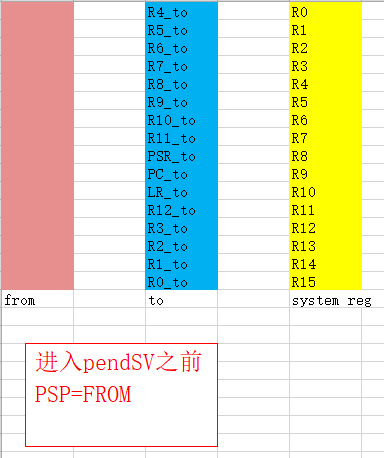
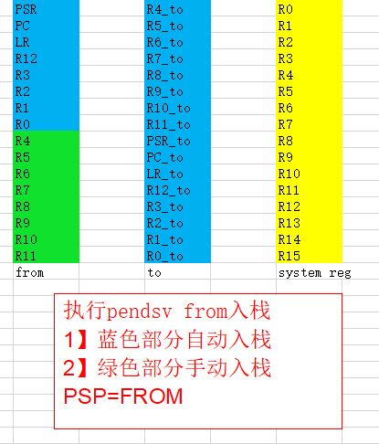
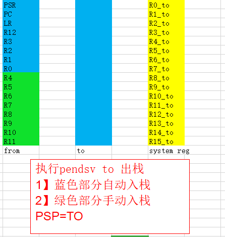

# 系统任务切换

在 Contex-M 里面上下文切换使用 PendSV异常来完成。RT-Thread 的libcpu抽象层实现三个线程相关的函数。

1、rt_hw_context_switch_to() ：没有来源线程，切换到目标线程。系统调度器启动第一个线程时使用此函数。

2、rt_hw_context_switch() ：在线程环境下，从当前线程切换到目标线程。

3、rt_hw_context_switch_interrupt()：在中断环境下，从当前线程切换到目标线程。

在任务切换的过程中，需要进行保护现场。

硬件在进入PendSV中断之前自动保存了from线程的PSR、PC、LR、R12、R3-R0寄存器，然后PendSV里保存FROM线程的R11-R4寄存器。

在PendSV里恢复to线程的R4-R11,退出PendSV中断，硬件自动恢复to线程的R0-R3、R12、LR、PC、PSR。

在中断是进行上下文切换时，需要等中断执行完毕。


## 系统任务切换的过程

线程切换和调用函数类似，但是不同线程的堆栈差异较大，不能简单当做调用函数去自动处理。所以我们要自己处理切换线程这部分的堆栈处理。保护现场。

现在利用mdk调试器，完整跟踪一次任务的切换过程

当前的工程中目前显示线程 是 **main** 主要内容是led闪烁，在 **main** 线程中会频繁调用```rt_thread_mdelay```进行延时，此时系统会进行任务调度，由于系统中目前没有其他任务，应该会切换到 **idle**线程。

在任务切换时，会涉及到俩个内容，一个是 **from\_thread** ,另一个是 **to\_thread** 。在我们这种情况下，**from\_thread** 就是 **main**，**to\_thread**就是**idle**。

### 1、当前正在运行 **main** 线程

MSP:0X20000FA0

PSP:0X200408A0

STACK:PSP

此时使用的是psp栈。

因为在**main**中主动调用了``rt_thread_mdelay``,此时就会启动一次任务切换的过程。切换的目标线程时**idle**。

### 2、 从一个线程切换到下一个线程

#### pendsv运行环境初始化
当我们要从一个线程切换到另一个线程，使用的函数是

``rt_hw_context_switch((rt_ubase_t)&from_thread->sp,(rt_ubase_t)&to_thread->sp);``

可以看到这个函数包含了俩个参数，是俩个线程的堆栈地址指针。

下面我们继续跟进，看一下这个函数的具体实现。

该函数的实现是用汇编代码，主要实现的功能是：

定义了变量


`IMPORT rt_thread_switch_interrupt_flag 进入pendsv异常标志`

`IMPORT rt_interrupt_from_thread 指向from线程的堆栈指针`

`IMPORT rt_interrupt_to_thread 指向to线程的堆栈指针`

上面对变量进行初始化，为了pendsv异常执行做准备。

接下来通过对相关寄存器的操作后触发pendsv异常。我们会在异常中完成任务切换。

####pendsv异常服务程序
当执行完毕`rt_hw_context_switch`之后，我们触发了pendsv异常，之后系统执行异常服务程序。

当进入**pendsv**异常时，硬件会自动将psr, pc, lr, r12, r3, r2, r1, r0压入堆栈。应为现在还没有完成线程切换，还在运行from线程。所以此时压入到了**from**线程的堆栈中。

接着开始执行pendsv代码。在进入pendsv之后，系统堆栈有psp模式变成msp模式。

pendsv程序主要流程

1、手动将R4-R11寄存器保存到from线程堆栈



2、手动将 to线程堆栈 pop R4-R11



3、将 psp 设置为 to 线程堆栈



当pendsv执行完毕时，会自动将psr, pc, lr, r12, r3, r2, r1, r0出栈，由于之前已经将psp设置为to线程堆栈。所以自动出栈的现场环境就是to线程的运行环境。

当完成pendsv异常和自动出栈之后，系统开始执行to线程的程序。任务切换完成。


**调用任务切换的汇编代码时 传入参数是线程堆栈指针**

## rt_hw_context_switch_to() 无来源线程切换

```
rt_hw_context_switch_to    PROC
    EXPORT rt_hw_context_switch_to
    ; R0是传入参数to 指向to线程的堆栈sp
   ;把to线程的堆栈信息保存到 rt_interrupt_to_thread 变量中
    LDR     r1, =rt_interrupt_to_thread
    STR     r0, [r1]

    IF      {FPU} != "SoftVFP"
    ; CLEAR CONTROL.FPCA
    MRS     r2, CONTROL             ; read
    BIC     r2, #0x04               ; modify
    MSR     CONTROL, r2             ; write-back
    ENDIF
    
    ;把变量 rt_interrupt_from_thread 清零 因为这里没有上文 只需要下文
    LDR     r1, =rt_interrupt_from_thread 
    MOV     r0, #0x0
    STR     r0, [r1]
    
    ;设置标志为 1 ，表示需要进行切换 变量在PendSV异常处理函数中切换时会将此变量清零
    LDR     r1, =rt_thread_switch_interrupt_flag
    MOV     r0, #1
    STR     r0, [r1]
    
    ;设置 PendSV 异常优先级为最低优先级
    LDR     r0, =NVIC_SYSPRI2
    LDR     r1, =NVIC_PENDSV_PRI
    LDR.W   r2, [r0,#0x00]       ; read
    ORR     r1,r1,r2             ; modify
    STR     r1, [r0]             ; write-back
    
    ; 触发 PendSV 异常 会进入PendSV 异常中断服务程序 进行寄存机保存恢复
    LDR     r0, =NVIC_INT_CTRL
    LDR     r1, =NVIC_PENDSVSET
    STR     r1, [r0]
    
    ; 把 msp 恢复到启动时状态 指向中断向量表
    LDR     r0, =SCB_VTOR
    LDR     r0, [r0]
    LDR     r0, [r0]
    MSR     msp, r0
    
    ; 使能全局中断和全局异常，使能之后将进入 PendSV异常处理函数
    CPSIE   F
    CPSIE   I
    
    ; never reach here!
    ENDP

```
## rt_hw_context_switch_interrupt
```
rt_hw_context_switch_interrupt
    EXPORT rt_hw_context_switch_interrupt
rt_hw_context_switch    PROC
    EXPORT rt_hw_context_switch

    ；判断变量 rt_thread_switch_interrupt_flag 的值是否为1 
    LDR     r2, =rt_thread_switch_interrupt_flag
    LDR     r3, [r2]
    CMP     r3, #1
    BEQ     _reswitch
    ；把 rt_thread_switch_interrupt_flag 变量设置为1
    MOV     r3, #1
    STR     r3, [r2]
    ;从 r0 读取传入的 from 线程信息 保存到变量 rt_interrupt_from_thread 
    LDR     r2, =rt_interrupt_from_thread   ; set rt_interrupt_from_thread
    STR     r0, [r2]

_reswitch

    ;从 r1 读取 to 线程信息 保存到变量 rt_interrupt_to_thread     
    LDR     r2, =rt_interrupt_to_thread     ;
    STR     r1, [r2]

    ；触发 PendSV 异常， 进入PendSV处理函数 完场上下文切换
    LDR     r0, =NVIC_INT_CTRL             
    LDR     r1, =NVIC_PENDSVSET
    STR     r1, [r0]
    BX      LR
    ENDP
```

## PendSV 中断处理函数
```
PendSV_Handler   PROC
    EXPORT PendSV_Handler

    ; 禁止全局中断
    MRS     r2, PRIMASK
    CPSID   I
    
    ; 判断变量 rt_thread_switch_interrupt_flag 的值是否为0 如果为0 跳转到 pendsv_exit执行 
    LDR     r0, =rt_thread_switch_interrupt_flag
    LDR     r1, [r0]
    CBZ     r1, pendsv_exit         ; pendsv already handled
    
    ; 把变量 rt_thread_switch_interrupt_flag 设置为 0
    MOV     r1, #0x00
    STR     r1, [r0]
    
    ；判断 rt_interrupt_from_thread 变量 如果变量为0跳过保存 from 线程信息
    LDR     r0, =rt_interrupt_from_thread
    LDR     r1, [r0]
    CBZ     r1, switch_to_thread    ; skip register save at the first time
    ；保存from线程信息
    MRS     r1, psp                 ; get from thread stack pointer
    
    IF      {FPU} != "SoftVFP"
    TST     lr, #0x10               ; if(!EXC_RETURN[4])
    VSTMFDEQ  r1!, {d8 - d15}       ; push FPU register s16~s31
    ENDIF
    
    STMFD   r1!, {r4 - r11}         ; push r4 - r11 register
    
    IF      {FPU} != "SoftVFP"
    MOV     r4, #0x00               ; flag = 0
    
    TST     lr, #0x10               ; if(!EXC_RETURN[4])
    MOVEQ   r4, #0x01               ; flag = 1
    
    STMFD   r1!, {r4}               ; push flag
    ENDIF
    
    LDR     r0, [r0]
    STR     r1, [r0]                ; update from thread stack pointer

；切换到 to 线程
；把to 堆栈信息 出栈
switch_to_thread
    LDR     r1, =rt_interrupt_to_thread
    LDR     r1, [r1]
    LDR     r1, [r1]                ; load thread stack pointer

    IF      {FPU} != "SoftVFP"
    LDMFD   r1!, {r3}               ; pop flag
    ENDIF
    ；恢复 to 线程寄存器的内容
    LDMFD   r1!, {r4 - r11}         ; pop r4 - r11 register
    
    IF      {FPU} != "SoftVFP"
    CMP     r3,  #0                 ; if(flag_r3 != 0)
    VLDMFDNE  r1!, {d8 - d15}       ; pop FPU register s16~s31
    ENDIF
    
    MSR     psp, r1                 ; update stack pointer
    
    IF      {FPU} != "SoftVFP"
    ORR     lr, lr, #0x10           ; lr |=  (1 << 4), clean FPCA.
    CMP     r3,  #0                 ; if(flag_r3 != 0)
    BICNE   lr, lr, #0x10           ; lr &= ~(1 << 4), set FPCA.
    ENDIF

；恢复全局中断 退出中断函数

pendsv_exit
    ; restore interrupt
    MSR     PRIMASK, r2

    ORR     lr, lr, #0x04
    BX      lr
    ENDP
```
