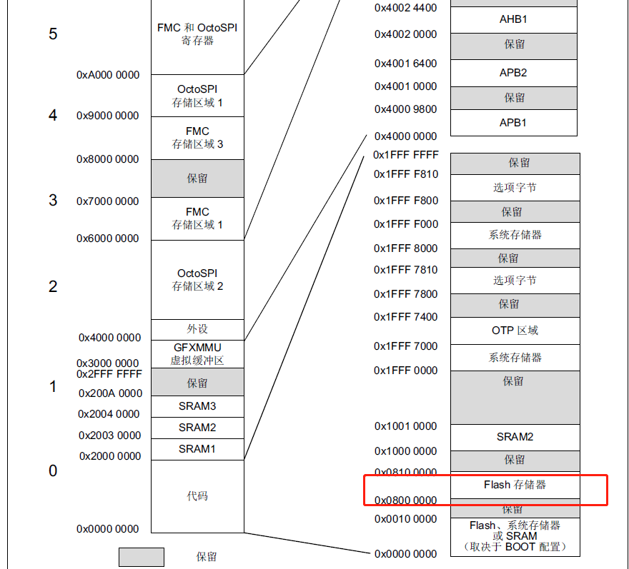

# RTThread 在stm32单片机启动流程分析
本文将会分析stm32单片机从**上电启动**到**rtthread系统**正常运行的过程。

单片机上电启动之后，自然是会去执行代码，执行代码，又会包括先要去某个地方读取代码，然后才能执行。那么，对于我们的stm32单片机，刚上电时，它是从哪里读取代码呢，他读取的代码又是从何而来呢？

让我我们一步一步去发现，去探索。让我们去对单片机启动的每一步都知根知底。

## 问题一 单片机运行时读取的代码来自哪里？
一旦开始去分析这个问题，会感觉这是一个无底洞，这是一个没有结束条件的递归问题。因为每想到一个问题，总会有一连串的问题出现。

好了，我们就带着我们的好奇心，一步步往下分析。

这个问题其实不难回答，任何玩过的人都会说出来，是我们下载的程序啊。好吧，就是这样的。但是我们今天要去更加深入的去研究一下。
### **程序**的一生
我们这里可以讲一下程序的一生，注意不是程序猿的一生，我是讲的他们的孩子。

首先呢，我们的程序员用键盘 咔咔咔 咔咔咔 敲下的每一个字符变成了程序最开始的样子。

接着经过编译器的编译处理，程序就被进行了一系列的加工处理。变成了 HEX 或者 BIN 等等格式的文件。

好了，到了这个时候，程序已经变成一个成熟的宝宝了，你可以去外面的世界闯荡了。程序去哪里能实现自己的人生价值呢，当然是让芯片去执行程序，才能发挥光和热，否则就是一个垃圾文件，随时可能被丢到回收站。没有在世间留下一丝痕迹。

在stm32芯片内部呢，有一个叫flash的部分，这里就是程序发挥光和热的地方。

对于STM32单片机，他的FLASH从地址**0X0800 0000**开始。当我们使用下载器下载程序的时候，就会把程序的数据内容写入到 **0X0800 0000**开始的位置。

紧接着，单片启动之后呢，就会从 **0X0800 0000**这个位置读取代码指令，然后去执行相应的代码。**到这里，我们可以回答上面的问题，单片机运行时读取的代码来自于 0X0800 0000开始的数据内容。**




## STM32第一行代码是什么？
上一个问题讲了stm32单片机的代码放在什么地方了。既然如此，
那这个问题就很好回答。我们去 **0X8000 0000**的地方看一下就知道第一行代码的内容的吧。这里我们借助了 MDK5 软件的调试功能。如图所示~
[FLASH 中的第一行代码](figure/firstcode.png)

根据mdk调试窗口提供的汇编代码我们可以看的到，这里的第一行程序指令其实时来自于startup_stm32l4r9xx文件中定义的部分变量。这些变量时中断的入口地址。

## ram的数据来自哪里？

我们知道，程序运行的过程中会定义变量。变量是放在什么位置呢？回忆一下，变量应该时在ram中，也就是我们说的内存中。但是到现在为止，我们只用到了flash这个存储器，并没有设计到ram。其实，程序在编译时，会把变量根据读写的性质分成几个区域，可以分为RO和RW,其中RW又会分成已经初始化的data段和未初始化的bss段。

### _scatterload 对ram初始化
通过查阅资料和分析flash中的汇编代码我们会发现，在定义了中断向量表之后，执行c语言的系统时钟初始化之前，会有一段额外的汇编代码。编译时编译器会将_scatterload代码链接进来。这段代码中便包含了将flash中的RW属性的变量等搬移到ram区域，其中data段会有初始化的值，而bss段会初始化为0。


## 真正的主人，c语言
到目前为止，前面部分执行的程序包含俩个来源，一部分时startup_stm32l4r9xx启动文件中的汇编代码，另一部分的ram初始化的汇编代码时编译器链接进去的。 这俩部分都是汇编语言程序。但是我们的主角时C语言才对。

运行C语言需要一些条件，初始化ram算是一部分，还有就是要对**堆**和**栈**进行初始化。**堆栈**是C语言运行的一个必要条件。

那么堆栈空间是怎么分配的呢，堆空间主要的作用是用于malloc分配内存空间，栈空间用于函数调用，局部变量等数据存放。在STM32的汇编启动文件中，会有对堆栈空间大小的设置。设置好了堆栈的大小之后，编译器会根据程序中的变量对ram区域进行分配。首先分配RW变量的空间，在RW空间分配结束后的地址便是堆空间的其实地址。堆空间其实地址加上堆空间大小，得到的即为栈空间的地址。

总结一下，也就是说堆栈的位置是顺序分配的，我们只需要设置其大下。然后按照 RW + HEAP + STACK 的排布去顺序分配。


---
**程序执行到这里，主要完成了三个部分**

1、定义了中断向量入口地址

2、初始化RAM空间

3、设置堆栈空间大小，编译器根据堆栈大小计算出堆栈位置

**经过以上部分的汇编代码，可以开始调用C语言的程序了**
---


## RTThread 怎么初始化各种外设
首先通过宏定义 **INIT_EXPORT** 对外设初始化函数进行设置。

该宏定义会定义一个指向初始化函数的函数指针，并且设置该函数指针连接到指定的段中。

所有的初始化函数指针位置都在函数指针变量 __rt_init_rti_start 到 __rt_init_rti_end 之间。根据不同的初始化等级，会有更加具体的链接位置和顺序。

当需要进行初始化是，C语言获取 __rt_init_rti_start 的地址，依次可以获取各个初始化函数的函数指针 fn_ptr; 通过执行 (*fn_ptr)();即可调用初始化函数进行外设和驱动初始化，
 
## rt_hw_board_init()

进行板级初始化。

调用```HAL_Init() ``` 。

调用 ``` SystemClock_Config() ``` 对系统时钟进行配置，此函数来自STM32cube配置生成

调用```rt_hw_systick_init()``` 根据系统节拍，配置系统滴答定时器。

如果在宏定义定义了```RT_USING_HEAP``` ,调用```    rt_system_heap_init((void *)HEAP_BEGIN, (void *)HEAP_END)``` 用来分配堆内存空间等。其中堆内存的分配地址范围由 board.h 中的宏定义指定。

调用```rt_hw_pin_init()``` 对PIN 设备驱动初始化。具体包含了开启硬件时钟，注册pin设备。

调用```rt_hw_usart_init()``` 对串口设备初始化。包括对硬件的寄存器配置初始化。注册串口设备。

调用```rt_console_set_device()``` 设置控制台输出设备。会将 rt_kprintf() 的输出重定向到该设备。

调用```rt_components_board_init()``` 对板子组件进行初始化。根据宏定义的设备进行依次初始化。执行这个函数会遍历 INIT_BOARD_EXPORT 申明的初始化函数，并调用各个函数。

## rt_show_version()

打印出RtThread图标和系统版本等信息。

## rt_system_timer_init()

对系统定时器进行初始化。在此处对定时器的链表初始化。

## rt_system_scheduler_init()

对内核调度相关链表资源初始化。

## rt_system_signal_init()

## rt_application_init() 

初始化线程，创建```main_thread_entry```线程。并启动线程。

## rt_system_timer_thread_init()

如果启用了软件定时器，在这里对软件定时器进行初始化。创建定时器线程。                           

## rt_thread_idle_init()

初始化空闲线程，并且启动空闲线程。空闲线程的优先级最低。当系统中无其他线程时，调度器调度并执行空闲线程。

## rt_hw_spin_lock(&_cpus_lock)

## rt_system_scheduler_start()

启动调度区，选择执行优先级最高的任务。

## 至此系统初始化完成

