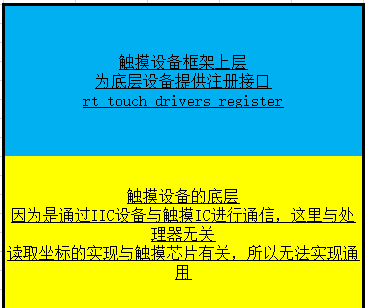
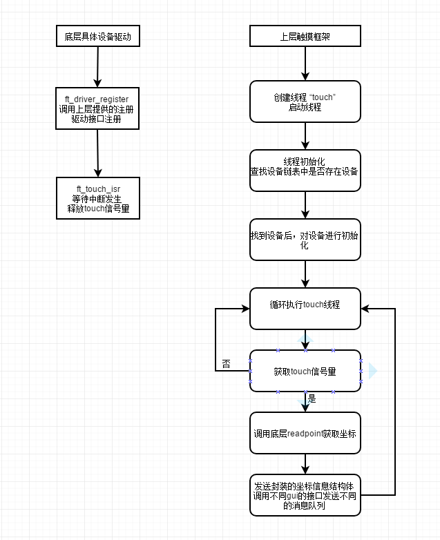

# TOUCH 设备
##触摸设备简介

触摸芯片设备的通讯接口：

- **I2C**:用于和主机进行通信。
- **INT PIN**:当产生触摸数据并且可以被读取时，产生中断提示处理器。

触摸芯片通过使用简单的上升沿或者下降沿中断触发读取，所以主机在应用触摸芯片的时候，不需要去一直查询数据。对主机资源占用较小。

当主机进入中断后，通过读取触摸芯片内部的坐标相关寄存器，就可以获取此时的触摸坐标。

## 触摸设备框架介绍



### STRUCT
```
/* 触摸信息结构体 封装坐标和事件 */
struct touch_message
{
    rt_uint16_t x;			//触摸横坐标
    rt_uint16_t y;			//触摸纵坐标
    rt_uint8_t event;		//触摸类型事件
};

```
### EVENT
```
TOUCH_EVENT_UP    触摸抬起事件

TOUCH_EVENT_DOWN  触摸按下事件  

TOUCH_EVENT_MOVE  触摸移动事件

TOUCH_EVENT_NONE  触摸无事件
```

```
/* 用于传递给上层框架 封装底层的实现接口 */
struct touch_ops
{
    void (* isr_enable)(rt_bool_t);
    rt_err_t (* read_point)(touch_msg_t);
    void (* init)(void);
    void (* deinit)(void);
};

/* 封装了一个触摸设备模型  */
struct touch_drivers
{
    rt_list_t       list;
    rt_bool_t (*probe)(void);
    rt_sem_t        isr_sem;
    touch_ops_t     ops;
  	void           *user_data;
};

/* 上层为底层提供的注册接口 */
void rt_touch_drivers_register(touch_drv_t drv);

```
### 底层（具体设备）需要提供的接口
```
/* 用于使能触摸芯片中断 */
void ft_isr_enable(rt_bool_t enable)；

/* 触摸中断服务函数 在这里释放触摸信号量 用于与上层框架线程同步 */
static void ft_touch_isr(void *parameter)；

/* 读取坐标点 此函数与具体的触摸芯片相关 在上层调用此函数获取坐标 */
static rt_err_t ft_read_point(touch_msg_t msg)；

```

## 触摸框架执行流程

touch设备会开启一个线程用于读取和处理触摸数据。

当触摸屏产生触摸时，会产生中断信号。在触摸中断函数中会释放一个信号量。

touch线程会持续获取此信号量，当touch线程获得信号量时，表示发生了触摸。线程开始通过iic通信读取触摸点的信息。

如果开启了GUI_ENGINEE包。touch线程读取到坐标之后，通过消息队列将该信息发送出去。GUI_ENGINEE会读取该消息队列的内容。获取触摸点。

